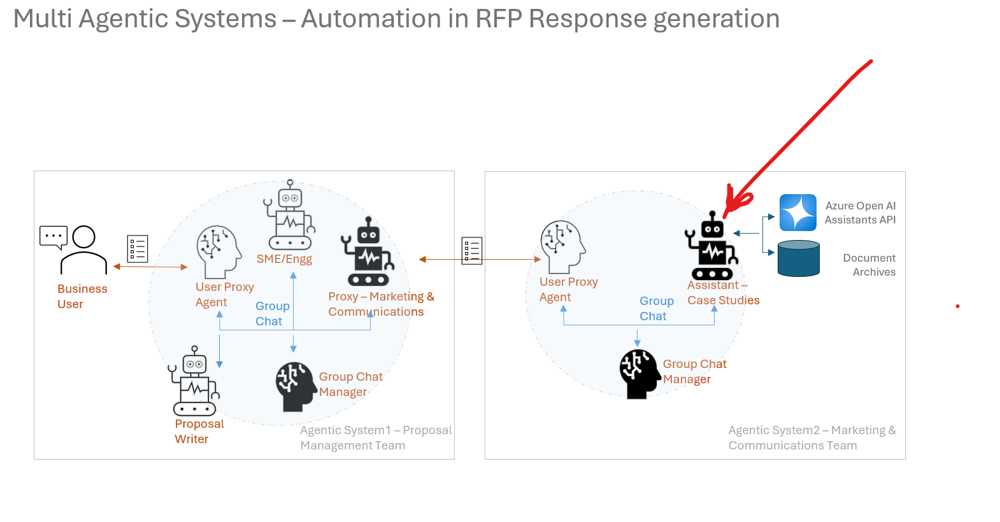

# corp-comms-asst
An AI Assistant for the Corporate Communications Team at Contoso. It is powered by Open AI Assistants API v2. It also implements autogen. It is meant to be used in tandem with Contoso Engineering Projects Assistant, to demonstrate multi agents scenario using autogen, running on different locations.

This is one part of the total showcased solution. The other part is the Contoso Engineering Projects Assistant, which is a separate repository.

## Solution Details

This is one part of the 2 part solution described above. See the diagram below

The multi agent system here is built using autogen 0.2 (pyautogen)
The Agent - 'CorpComms-Assistant' is powered by a custom Assistant created from the base ConversibleAgent in autogen.
It implements v2 of Azure OpenAI Assistants API, and uses the turnkey vector search capability in it.
When a request comes from the other Agentic System (Contoso Engineering Projects Assistant - not covered in this Repo)  asking for case studies and testimonials to be included in an RFP Response, the 'CorpComms-Assistant' Agent calls the Assistants APIv2 vector search to return relevant case studies and testimonials and returns it to the calling system.

## Get Started

1) Creating a Vector Store in Azure OpenAI Assistants v2 Playground

The folder  contains the sample PDF documents that need to be vectorised.
Import these to the playground and create a vector database. Note down the ID of the Vector store created
Create an Assistants API v2 App in the playground, assign a name, and instructions and save it. Note down the ID of the Assistant created. Both the IDs need to be set in the config of the application.

2) Create a virtual environment for the App, install the libraries (Note this is based on pyautogen, which corresponds to autogen 0.2, and not the latest, which is 0.4)

3) Run the app,it should start listening for calls from the other Agentic System

